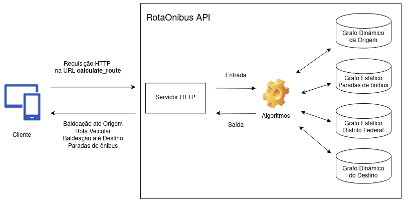

# Arquitetura API

A API, ou Application Programming Interface, é um conjunto de regras e protocolos que permitem que diferentes softwares se comuniquem e interajam entre si. Em termos simples, uma API define como componentes de software devem interagir, quais operações estão disponíveis e quais dados podem ser acessados. As APIs são essenciais para permitir a integração entre sistemas e aplicativos diferentes.

É importante citar que, no contexto de produto, o cliente almejava apenas um Motor (*Engine*) para o sítio/aplicativo dele. Portanto, a camada de *View* (tomando como base um arquitetura MVC) está sendo tratada por parte do *Product Owner* (*PO*), ou seja, é a camada na qual o usuário está visualizando a interface, no qual a partir dela vai ser realizada uma requisição para a API, que retornará a saída esperada.

Dessa forma, o diagrama de Arquitetura da API, na figura 1, expressa justamente o comportamento e fluxo interno na API, sem se preocupar com a camada da *View*.

Figura 1. Arquitetura da API.

## Fluxo da API

Embasado na figura 1, é possível mapear o FLuxo completo da API, desde o recebimento da requisição até o retorno da saída esperada. O fluxo está descrito nos passos a baixo:

1. A API recebe uma requisição HTTP (*POST*) na URL **calculate_route**, e passa por parâmetro um JSON contendo current_location e destiny_location, ambos com as coordenadas *lat* e *lon*, latitude e longitude, respectivamente.

2. A API transforma os parâmentros da Entrada em *data*, da classe *InputData*, e passa o *data* para os Agoritmos (*Controller* em MVC) trabalharem.

3. A *Controller* (Algoritmos) utiliza o arquivo Grafo Estático das Parada de Ônibus, bem como as coordenadas da Origem e Destino, para calcular a **Rota Ótima**, que contém as Linhas de ônibus e as Paradas de ônibus usadas na rota. Nessa etapa é gerado o objeto **Paradas de ônibus**, retornado na saída.

4. A *Controller* (Algoritmos) gera um Grafo Dinâmico a partir da Origem, e com base primeira Parada de ônibus a ser pega, dentro de **Paradas de ônibus**, é calculado a **Baldeação até Origem**, que representa todos os pontos que o usuário tem que andar da Origem até a primeira parada de ônibus.

5. Para gerar a **Rota Veicular**, o *Controller* (Algoritmos) utiliza o Grafo Estático do Distrito Federal e as **Paradas de ônibus** para calcular todos os pontos (com latitude e longitude) entre as paradas de ônibus. O resultado é o caminho que o(s) ônibus percorrerão para transportar o usuário da primeira parada até a última.

6. Similar ao passo 4, é necessário calcular a baldeação até o Destino, mas será utilizando a última parada e o Grafo Dinâmico do Destino. Sendo assim, o resultado é o objeto **Baldeação até Origem**.

7. Após o cálculo dos objetos necessários, o *Controller* (Algoritmos) os retorna em formato JSON (Saída) para o Servidor HTTP.

8. O Servidor HTTP, por sua vez, retorna os objetos desejados para o cliente..

## Histórico de Versão

| Versão |      Alteração       | Responsável  | Revisor | Data  |
| :----: | :------------------: | :----------: | :-----: | :---: |
|  1.0   | Criação do documento | Leonardo Vitoriano |    -    | 02/11 |
|  1.1   | Adição do Fluxo da API | Leonardo Vitoriano |    -    | 05/11 |
