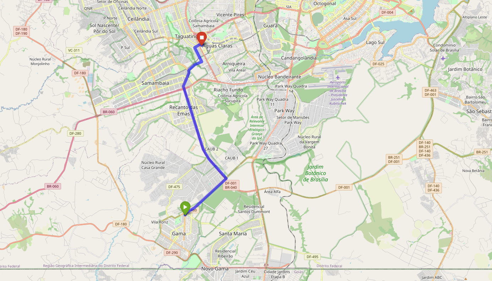

# Benchmark do OSRM

## Passo a passo para instalação do OSRM

### 1. Instalação do Docker

Para instalar o Docker, siga os passos do [site oficial](https://docs.docker.com/engine/install/ubuntu/).

### 2. Baixar dados do OpenStreetMap

Para baixar os dados disponibilizados pelo OpenStreetMap, pode-se utilizar do site [geofabrik](http://download.geofabrik.de/).

### 3. Configuração do OSRM

### 4. Descompactar os dados do OpenStreetMap

Siga os passos a passos disponibilizados na [documentação oficial](https://github.com/Project-OSRM/osrm-backend)

Basicamente, são os comandos:

```
docker run -t -v "${PWD}:/data" ghcr.io/project-osrm/osrm-backend osrm-extract -p /opt/car.lua /data/centro-oeste-latest.osm.pbf || echo "osrm-extract failed"


docker run -t -v "${PWD}:/data" ghcr.io/project-osrm/osrm-backend osrm-partition /data/centro-oeste-latest.osrm || echo "osrm-partition failed"
docker run -t -v "${PWD}:/data" ghcr.io/project-osrm/osrm-backend osrm-customize /data/centro-oeste-latest.osrm || echo "osrm-customize failed"
```

Note que os comandos estão adaptados para a realidade do arquivo centro-oeste baixado anteriormente. Caso o arquivo baixado seja outro, é necessário alterar o nome do arquivo nos comandos.

Após os comandos acima, inicializamos o container docker com os arquivos criados:

```
docker run -t -i -p 5000:5000 -v "${PWD}:/data" ghcr.io/project-osrm/osrm-backend osrm-routed --algorithm mld /data/centro-oeste-latest.osrm
```

### 5. Rodando o OSRM

Com isso, já teremos o projeto do OSRM rodando em nossa máquina local via container docker, podemos fazer solicitações via request nesse container:

```
http://127.0.0.1:5000/route/v1/driving/-48.043619,-16.000091;-48.043619,-15.842141
```

Nos parâmetros, passamos a latitude e longetude do ponto de inicio e longitude e latitude do ponto de destino, separados por ponto e vírgula.

```
{
  "code": "Ok",
  "routes": [
    {
      "geometry": "f|s`BpufdHnEtC}E|ItX|RmJ`Pei@m@_uDioEqLzRecB~sA_v@xb@unJnwBgjAgb@ePr@w_@se@_Pwf@{qAdj@oWuj@vGgCvBvE",
      "legs": [
        {
          "steps": [],
          "summary": "",
          "weight": 1698.7,
          "duration": 1698.7,
          "distance": 23945.3
        }
      ],
      "weight_name": "routability",
      "weight": 1698.7,
      "duration": 1698.7,
      "distance": 23945.3
    }
  ],
  "waypoints": [
    {
      "hint": "BGoQgApqEIAXAAAAAAAAAHQAAAB9AAAAW4IbQQAAAACHxkFC8otRQhcAAAAAAAAAdAAAAH0AAADCAAAA6OUi_bfdC_-d6SL9pdsL_wEALwJgC8Vo",
      "distance": 117.30249163,
      "name": "",
      "location": [
        -48.044568,
        -15.999561
      ]
    },
    {
      "hint": "v6UTgP___389AAAAQQAAAAAAAABZAAAAaPGjQiO-qUAAAAAAN6e4Qj0AAABBAAAAAAAAAFkAAADCAAAAm-ki_ahEDv-d6SL9o0QO_wAAXw9gC8Vo",
      "distance": 0.593319936,
      "name": "Avenida Arniqueira",
      "location": [
        -48.043621,
        -15.842136
      ]
    }
  ]
}
```

## Visualizando o resultado das rotas

### Imports

Para o benchmark, utilizamos as seguintes bibliotecas:

```
import requests
import folium
import polyline
import numpy as np
import pandas as pd
```

### Polyline

Para a visualização das rotas, utilizamos a biblioteca do google, a polyline, que transforma a string de geometria retornada pelo OSRM em uma lista de coordenadas.

```
polyline.decode('f|s`BpufdHnEtC}E|ItX|RmJ`Pei@m@_uDioEqLzRecB~sA_v@xb@unJnwBgjAgb@ePr@w_@se@_Pwf@{qAdj@oWuj@vGgCvBvE')
```

Com isso, gerando o resultado:

```
[(-15.99956, -48.04457),
 (-16.0006, -48.04532),
 (-15.99949, -48.04707),
 (-16.0036, -48.05026),
 (-16.00177, -48.05299),
 (-15.99502, -48.05276),
 (-15.9659, -48.01943),
 (-15.96373, -48.02261),
 (-15.9477, -48.03621),
 (-15.9389, -48.04194),
 (-15.88007, -48.06122),
 (-15.86803, -48.05558),
 (-15.86528, -48.05584),
 (-15.86004, -48.04966),
 (-15.85732, -48.0433),
 (-15.84406, -48.05021),
 (-15.84014, -48.04322),
 (-15.84154, -48.04254),
 (-15.84214, -48.04362)]
```

## Função de busca

Com os detalhes fornecidos, podemos implementar a função em python que irá chamar o nosso container e já irá aplicar o polyline para a visualização das rotas, ponto inicial, ponto final e distância.

```
def get_route(pickup_lon, pickup_lat, dropoff_lon, dropoff_lat):

    loc = "{},{};{},{}".format(pickup_lon, pickup_lat, dropoff_lon, dropoff_lat)
    url = "http://127.0.0.1:5000/route/v1/driving/"
    r = requests.get(url + loc)
    if r.status_code!= 200:
        return {}

    res = r.json()
    routes = polyline.decode(res['routes'][0]['geometry'])
    start_point = [res['waypoints'][0]['location'][1], res['waypoints'][0]['location'][0]]
    end_point = [res['waypoints'][1]['location'][1], res['waypoints'][1]['location'][0]]
    distance = res['routes'][0]['distance']

    out = {'route':routes,
           'start_point':start_point,
           'end_point':end_point,
           'distance':distance
          }

    return out
```

Chamando a função:

```
pickup_lon, pickup_lat, dropoff_lon, dropoff_lat = -48.059358,-16.000091,-48.043619,-15.842141
test_route = get_route(pickup_lon, pickup_lat, dropoff_lon, dropoff_lat)
test_route
```

retorno da função:

```
{'route': [(-16.00009, -48.05936),
  (-15.9975, -48.05801),
  (-15.99324, -48.05046),
  (-15.96603, -48.01943),
  (-15.9477, -48.03621),
  (-15.9389, -48.04194),
  (-15.88007, -48.06122),
  (-15.86803, -48.05558),
  (-15.86528, -48.05584),
  (-15.86004, -48.04966),
  (-15.85732, -48.0433),
  (-15.84406, -48.05021),
  (-15.84014, -48.04322),
  (-15.84154, -48.04254),
  (-15.84214, -48.04362)],
 'start_point': [-16.000091, -48.05936],
 'end_point': [-15.842136, -48.043621],
 'distance': 22854.3}
```

## Plotando o resultado

Iremos plotar o resultado utilizando o Folium.

### Função

```
def get_map(route):

    m = folium.Map(location=[(route['start_point'][0] + route['end_point'][0])/2,
                             (route['start_point'][1] + route['end_point'][1])/2],
                   zoom_start=13)

    folium.PolyLine(
        route['route'],
        weight=8,
        color='blue',
        opacity=0.6
    ).add_to(m)

    folium.Marker(
        location=route['start_point'],
        icon=folium.Icon(icon='play', color='green')
    ).add_to(m)

    folium.Marker(
        location=route['end_point'],
        icon=folium.Icon(icon='stop', color='red')
    ).add_to(m)

    return m
```

#### Chamando a função

```
get_map(test_route)
```

#### Resultado



O resultado é praticamente instantâneo!

## Benchmark

Para o benchmark, iremos gerar 100, 1000 e 10000 pontos aleatórios com base na latitude e longitude de Brasília, e iremos calcular a distância entre eles utilizando o OSRM.

## Gerando os pontos aleatórios

### 100 pontos

```
lon1 = np.random.uniform(-48.0,-49.0, 100).round(6)
lon2 = np.random.uniform(-48,-49.0, 100).round(6)
lat1 = np.random.uniform(-15.8,-16.0, 100).round(6)
lat2 = np.random.uniform(-15.8,-16.0, 100).round(6)
df = pd.DataFrame({'pickup_lon': lon1,
              'pickup_lat': lat1,
              'dropoff_lon': lon2,
              'dropoff_lat': lat2,
             })
```

#### Execução

```
%%time
df['routes'] = df.apply(lambda x: get_route(x['pickup_lon'],
                                            x['pickup_lat'],
                                            x['dropoff_lon'],
                                            x['dropoff_lat']), axis=1)
```

#### Resultado

```
CPU times: user 123 ms, sys: 16.3 ms, total: 139 ms
Wall time: 239 ms
```

O tempo para o cálculo de 100 rotas simultaneamente foi de 239 milisegundos.

A configuração do computador utilizado foi:

```
Ryzen 7 5800H
NVIDIA RTX 3060M
16GB RAM
```

### 1000 pontos

```
lon1 = np.random.uniform(-48.0,-49.0, 1000).round(6)
lon2 = np.random.uniform(-48,-49.0, 1000).round(6)
lat1 = np.random.uniform(-15.8,-16.0, 1000).round(6)
lat2 = np.random.uniform(-15.8,-16.0, 1000).round(6)
df = pd.DataFrame({'pickup_lon': lon1,
              'pickup_lat': lat1,
              'dropoff_lon': lon2,
              'dropoff_lat': lat2,
             })
```

#### Execução

```
%%time
df['routes'] = df.apply(lambda x: get_route(x['pickup_lon'],
                                            x['pickup_lat'],
                                            x['dropoff_lon'],
                                            x['dropoff_lat']), axis=1)
```

#### Resultado

```
CPU times: user 1.36 s, sys: 39.3 ms, total: 1.4 s
Wall time: 2.48 s
```

O tempo para o cálculo de 1000 rotas simultaneamente foi de 2.48 segundos.

A configuração do computador utilizado foi:

```
Ryzen 7 5800H
NVIDIA RTX 3060M
16GB RAM
```

### 10000 pontos

```
lon1 = np.random.uniform(-48.0,-49.0, 10000).round(6)
lon2 = np.random.uniform(-48,-49.0, 10000).round(6)
lat1 = np.random.uniform(-15.8,-16.0, 10000).round(6)
lat2 = np.random.uniform(-15.8,-16.0, 10000).round(6)
df = pd.DataFrame({'pickup_lon': lon1,
              'pickup_lat': lat1,
              'dropoff_lon': lon2,
              'dropoff_lat': lat2,
             })
```

#### Execução

```
%%time
df['routes'] = df.apply(lambda x: get_route(x['pickup_lon'],
                                            x['pickup_lat'],
                                            x['dropoff_lon'],
                                            x['dropoff_lat']), axis=1)
```

#### Resultado

```
CPU times: user 11.7 s, sys: 677 ms, total: 12.4 s
Wall time: 22.5 s
```

O tempo para o cálculo de 10000 rotas simultaneamente foi de 22.5 segundos.

A configuração do computador utilizado foi:

```
Ryzen 7 5800H
NVIDIA RTX 3060M
16GB RAM
```

## Conclusão

Com os resultados, concluímos que o OSRM é muito poderoso, porém, ele não tem atualmente o perfil para viagem de ônibus, o que é um problema para o nosso projeto, mas caso prosseguirmos com o OSRM, podemos utilizar o perfil de carro e fazer a conversão para o perfil de ônibus, que seria um trabalho a mais, mas que pode ser feito para a entrega final do projeto.

## Histórico de versão

| Versão |                 Alteração                 | Responsável  | Revisor | Data  |
| :----: | :---------------------------------------: | :----------: | :-----: | :---: |
|  1.0   | Criando documentação do benchmark do OSRM | Lucas Frazão |    -    | 23/07 |
