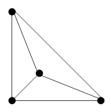
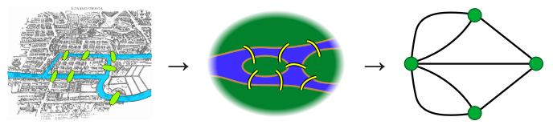

# Grafos e o Algoritmo de Dijkrstra

## Grafo e Aresta 

Um grafo é uma estrutura de dados composta por um conjunto de vértices (também chamados de nós) e um conjunto de arestas que conectam esses vértices. É uma representação visual e matemática de um conjunto de objetos interconectados.

 

Formalmente, um grafo G é definido como um par ordenado (V, E), onde V é o conjunto de vértices e E é o conjunto de arestas. As arestas podem ser direcionadas (possuem uma direção) ou não direcionadas (não possuem uma direção específica). Além disso, as arestas podem ter pesos ou valores associados a elas.

## Problema das Pontes de Königsberg

O Problema das Pontes de Königsberg é um famoso problema matemático relacionado à teoria dos grafos. O problema é baseado nas sete pontes que atravessam o rio Pregel em Königsberg (atual Kaliningrado, Rússia), e foi formulado pelo matemático suíço Leonhard Euler em 1736.

O desafio consiste em determinar se é possível traçar um caminho que passe por todas as pontes uma única vez e volte ao ponto de partida. No problema original, existiam duas ilhas e sete pontes que as conectavam, formando uma estrutura semelhante a uma figura conhecida como grafo.

## Solução do problema das pontes de Königsberg

Como mencionado anteriormente, Euler foi o matemático que conseguiu resolver o problemas das pontes de Königsberg. Para resolver, ele propôs simplificar o problema em um modelo menor, no qual um circulo representa a terra firme e as linhas representam as pontes. A imagem representando é mostrada novamente na imagem abaixo.

A solução consiste em mostrar que não é possível retornar a um vértice (terra firme) caso o número de pontes conectadas a ele seja ímpar. Isso ocorre porque, nesse caso, ao sair de um vértice que é o ponto inicial e final do destino e percorrer todas as arestas (pontes), acabaríamos fora do vértice. Portanto, observe que no problema proposto, todos os vértices possuem um número ímpar de arestas, e o problema requer que comecemos e terminemos no mesmo vértice. Ao percorrer todas as arestas, sempre teríamos passado uma quantidade ímpar de arestas conectadas a esse vértice, o que mostra que não há solução para esse problema.

No entanto, há uma única possibilidade de sair de um vértice e retornar a ele passando apenas uma vez pelas arestas. Grafos que atendem a essa condição são chamados de grafos eulerianos e seguem o seguinte teorema:

*Um grafo será euleriano se for conexo e todos os seus vértices tiverem um número par de arestas conectadas a eles.*

## Referências

