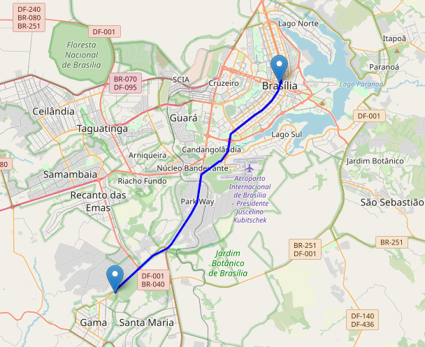

# Benchmark do OSM

## 1. Introdução 

Benchmark do Open Street Map (OSM), buscando traçar uma rota entre dois pontos (UnB FGA e Conjunto Nacional) com o objetivo de avaliar a complexidade e a dificuldade em utilizar a ferramenta, bem como medir o seu tempo de resposta.

## 2. Configuração da máquina utilizada no Benchmark

A configuração do computador utilizado foi:

- Modelo de Hardware: Dell Inc. Latitude 3420
- Memória: 16GB de RAM 
- Processador: 11th Gen Intel® Core™ i7-1165G7 @ 2.80GHz × 8


## 3. Bibliotecas utilizadas

As bibliotecas utilizadas para a realização desse Benchmark são:

- osmnx
- networkx
- folium

Uma descrição mais detalhada delas pode ser encontrada na [documentação](https://residenciaticbrisa.github.io/02_RotaOnibus/#/./Estudos/OpenStreetMap?id=_31-biblioteca-osmnx). 

### 3.1 Configurando bibliotecas

1. Primeiro, instale as bibliotecas Python necessárias **osmnx** e **networkx**. Você pode instalá-los usando pip:

```
pip install osmnx networkx
```

2. Importe os módulos necessários em seu script Python:

```python
import osmnx as ox
import networkx as nx
```

## 4. Grafo e cálculo da menor rota

Para que seja possível calcular uma rota entre 2 pontos, faz se necessário saber em qual região eles estão. Pois, a partir do domínio dessa área específica é possível gerar o Grafo da região, em seguida saber os nós vizinhos entre ponto de origem e destino, também conhecida como vizinhança (*neighborhood*). Depois que já se conhece a vizinhança entre os nós, utiliza-se algoritmos de menor distância em Grafos: Dikstra e obtém-se a menor rota entre os 2 pontos definidos.

### 4.1 Grafo

Define a área do Grafo e gera Grafo com ruas públicas dirigíveis, incluindo estradas de serviço.

```python
place = 'Distrito Federal, Brasilia, Brazil'
G = ox.graph_from_place(place, network_type='drive_service')
```

O tempo para a geração do Grafo a partir de uma região foi de 1 minuto e 56 segundos. 

        CPU times: user 1min 54s, sys: 1.53 s, total: 1min 56s
        Wall time: 1min 56s

### 4.2 Cálculo da menor rota 

A definição dos pontos de origem e destino é feita com suas respectivas latitudes e longitudes. Sendo os pontos listados abaixo:

- origem : Unb Gama
- destino : Conjunto Nacional

Em seguida, a vizinhança entre os pontos é obtida. E o cálculo da menor rota é feito utilizando o algoritmo de Dijkstra.

```python
orig = (-15.989444964529529, -48.044418962814866) # Unb Gama
dest = (-15.79113644987054, -47.88317800514907)   # Conjunto Nacional

orig_node = ox.nearest_nodes(graph, orig[1], orig[0])
dest_node = ox.nearest_nodes(graph, dest[1], dest[0])

shortest_path = nx.shortest_path(graph, orig_node, dest_node, weight='length')
```
O tempo para o cálculo da menor rota foi de 2.71 segundos. 

        CPU times: user 2.71 s, sys: 3.83 ms, total: 2.72 s
        Wall time: 2.71 s

## 5. Visualizando a Rota

A visualiação da rota é realizada a partir da biblioteca **folium**. O mapa é criado e precisa dos seguintes parâmetros:

- nó de origem
- nó de destino
- nós da rota entre origem e destino

Depois de adicionar tudo o que for necessário para o mapa, a sua plotagem é feita e é possível visualizar a rota almejada.

```python
m = folium.Map(location=orig, zoom_start=12)

folium.Marker(location=orig, popup="Origin").add_to(m)
folium.Marker(location=dest, popup="Destination").add_to(m)

route_coordinates = [(graph.nodes[node]['y'], graph.nodes[node]['x']) for node in shortest_path]
folium.PolyLine(locations=route_coordinates, color='blue').add_to(m)

m
```

A figura 1 ilustra a rota entre a UnB Gama e o Conjunto Nacional.




## 6. Conclusão

O Open Street Map é fundamental para o cálculo de rotas, pois ele que é a fonte dos dados geográficos, mapeando diferentes elementos, como estradas, edifícios, pontos de referência, rios e pontos de interesse. Porém, ao utilizar a biblioteca **osmnx** para gerar o Grafo de uma região alvo, utilizando 2 pontos dentro do domínio dessa área mapeada, é um processo demorado, tendo em vista que só na geração do Grafo do Distrito Federal demorou mais de 2 minutos.

## 7. Referências

- [Osmnx Docs](https://osmnx.readthedocs.io/en/stable/user-reference.html)
- [OSM Main Page](https://wiki.openstreetmap.org/wiki/Main_Page)
- [Overpass API](https://wiki.openstreetmap.org/wiki/Overpass_API)
- [Networkx](https://networkx.org/documentation/stable/auto_examples/geospatial/plot_osmnx.html)
- [Osmnx Tutorial](https://geoffboeing.com/2016/11/osmnx-python-street-networks/)
- [routing-speed-time Tutorial](https://github.com/gboeing/osmnx-examples/blob/v0.13.0/notebooks/02-routing-speed-time.ipynb)

## 8. Histórico de Versão

| Versão | Alteração | Responsável | Revisor | Data  |
| :----: | :-------: | :---------: | :-----: | :---: | 
| 1.0    | Criando documentação do Benchmark do OSM | Leonardo Vitoriano | - | 23/07 |


