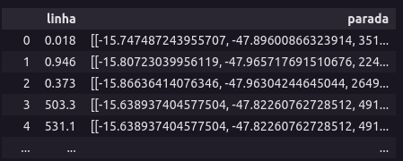

# Salvando paradas de linhas de ônibus a partir de arquivos shapefiles

## Objetivo

O objetivo deste trabalho é identificar as paradas pertencentes às linhas de ônibus a partir de seus arquivos shapefiles.

## Métodologia

A metodologia adotada consistiu em utilizar as bibliotecas Geopandas e Folium, amplamente utilizadas para análise geoespacial e visualização de dados, respectivamente. O processo seguiu as seguintes etapas:

1. **Carregamento dos Arquivos Shapefiles:** Os arquivos shapefiles contendo informações sobre as linhas de ônibus e suas paradas foram carregados usando a biblioteca Geopandas. Isso permitiu acessar as geometrias das linhas e das paradas.

2. **Identificação de Paradas por Proximidade:** As linhas de ônibus foram filtradas para selecionar apenas as linhas de ida, e em seguida, foi realizado um processo de iteração sobre cada linha para identificar as paradas próximas a essa linha. Para isso, foi calculada a distância entre a linha e cada ponto de parada usando a função `distance` da biblioteca Shapely. Paradas cuja distância fosse menor que um limite pré-estabelecido foram consideradas como pertencentes à linha em questão.

3. **Criação de um DataFrame com os Resultados:** Para cada linha de ônibus, as paradas identificadas foram armazenadas em uma lista, juntamente com suas coordenadas e identificadores. Essas listas foram então adicionadas a um DataFrame, que posteriormente foi salvo em um arquivo CSV.

4. **Visualização com Folium:** A biblioteca Folium foi utilizada para criar um mapa interativo. Para cada linha de ônibus, suas paradas identificadas foram representadas por marcadores no mapa.

## Resultados

Os resultados obtidos revelaram a relação espacial entre as linhas de ônibus e suas respectivas paradas. O DataFrame resultante permitiu uma análise mais detalhada das paradas associadas a cada linha. Além disso, a visualização no mapa interativo ofereceu uma compreensão mais intuitiva das rotas e da distribuição das paradas.

## Estrutura do arquivo .csv com as linhas e paradas

O conjunto de dados gerado possui uma estrutura organizada, composta por uma coluna chamada 'linha', que contém as linhas de ônibus, e uma coluna chamada 'parada', que armazena as coordenadas geográficas (longitude e latitude) de cada parada, juntamente com um identificador único para a parada. O esquema desses dados é ilustrado na figura abaixo.

## Conclusão

O uso das bibliotecas Geopandas e Folium demonstrou ser uma abordagem eficaz para a identificação e visualização das paradas de ônibus associadas a diferentes linhas. A análise geoespacial e a representação gráfica permitiram uma compreensão mais aprofundada das rotas de ônibus e das paradas, auxiliando na tomada de decisões relacionadas ao transporte público e na análise do sistema de transporte.

## Histórico de Versão

| Versão |     Alteração     | Responsável | Data    |
| :----: | :---------------: | :----------: | :-----: |
|  1.0   | Criando documento | Luiz       |  14/08 |

