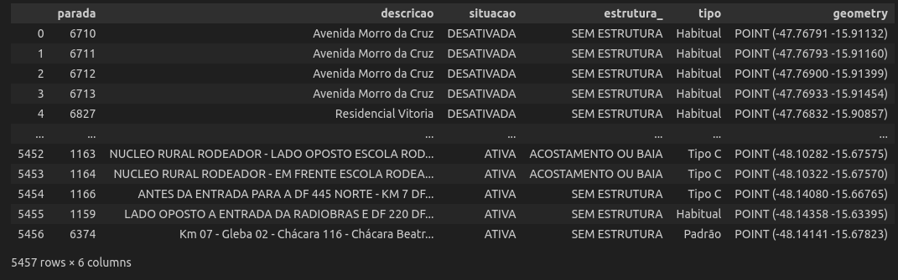
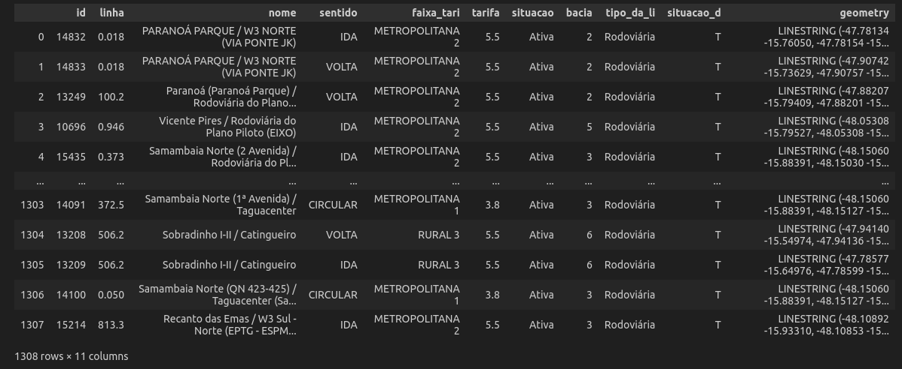

# Rotas em Grafos (Pseudocódigo)

## Tratamento das Paradas e Rotas de ônibus do DF 
 
A [Semob](https://semob.df.gov.br/) (Secrataria de Transporte e Mobilidade) do Distrito Federal fornece todos os dados sobre as paradas e rotas de ônibus em arquivos de vários formatos nesse [link](https://geoserver.semob.df.gov.br/geoserver/web/wicket/bookmarkable/org.geoserver.web.demo.MapPreviewPage?0&filter=false). Mas o formato que mais interessa para o contexto do projeto é o arquivo [Shapefile](https://residenciaticbrisa.github.io/02_RotaOnibus/#/./Estudos/EstudoShapeFiles?id=_1-o-que-s%c3%a3o-arquivos-shapefiles) das paradas e ônibus. 

O arquivo Shapefile das paradas, após ser lido e transformado em um GeoDataFrame, é descrito com as informações apresentadas na Figura 1. A coluna 'geometry' contém o POINT das paradas, ou seja, o GPS (latitude e longitude) delas. Essa coluna será importante pois iremos tentar encontrar essas coordenadas das paradas nas linhas de ônibus.

Figura 1. DataFrame Paradas

Já o arquivo Shapefile das linhas, após ser lido e transformado em um GeoDataFrame, é descrito com as informações apresentadas na Figura 2. A coluna 'geometry' agora contém uma LINESTRING da linha de ônibus, ou seja, todos os pontos que uma ônibus passa até completar a rota completa. Dessa maneira, esse LINESTRING de cada rota possuí informações irrelevantes (todo o trajeto feito pelo ônibus) para o usuário final. Sendo assim, o objetivo dessa limpeza é retirar todos os pontos desnecessários da LINESTRING de cada rota, resultando em uma LINESTRING que possua apenas os POINTs das paradas de ônibus por qual uma rota trafega.

Figura 2. DataFrame Linhas

Todo o tratamento das paradas e linhas de ônibus pode ser encontrada nesse [notebook](https://github.com/ResidenciaTICBrisa/02_RotaOnibus/blob/main/docs/Notebooks/testeParadasLinhasLuiz.ipynb).

## Estrutura do Grafo

<!-- Após o tratamento das paradas e linhas de ônibus, foi gerada um Data Frame que contém todas as paradas de u

Nó:
Aresta:

Transformar Paradas -->

## Linhas de Onibus em Subgrafos

## Junção dos SubGrafos em um único Grafo

## Replicar para todo o Brasil

## Referências

- 1. [Semob](https://semob.df.gov.br/)

## Histórico de Versão

| Versão | Alteração | Responsável | Revisor | Data  |
| :----: | :-------: | :---------: | :-----: | :---: | 
| 1.0    | Criação Pseudocódigo  | Leonardo Vitoriano | - | 03/08 |

