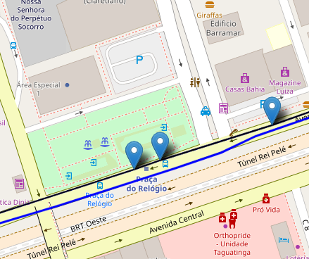

# Remoção de ruídos

## 1. O que é um ruído?

Ao transformar os arquivos disponibilizados pela SEMOB (Secretaria de Mobilidade e Transporte) em um grafo, algumas paradas acabaram por ficar muito próximas. Essas paradas foram chamadas de ruídos.

Eles passaram a se mostrar um problema, ao afetar o cálculo da melhor rota.

A imagem abaixo mostra um exemplo de ruído:

## 2. Eliminando ruídos

Tendo em vista o problema que os ruídos haviam se tornado, foi necessário encontrar uma maneira de contorna-lo.

Para isso foram idelizados alguns algortimos que poderiam resolver esses problemas. Os principais foram o de Média e Mediana e o da utilização do DBSCAN.

### 2.1 Média e Mediana

**Preparação para filtragem de paradas que não fazem parte de uma rota.** 

O projeto consiste em calcular a média das distâncias entre as paradas e em seguida colocar um limiar abaixo para que as paradas muito próximas uma das outras sejam eliminadas.

$$ média\ das\ distâncias = \sum_{i=0}^{n} \frac{distâncias_{i}}{n-1}$$

$n: número\ de\ paradas$

As etapas de dessa filtragem são:

**Passo 1: Preparação dos Dados**

- Deixar o dataframe das paradas em ordem ao longo da rota e indexadas.
- Calular as distâncias entre paradas consecutivas.

**Passo 2: Definição de Limiares**

- Calcular a média das distâncias entre as paradas.
- Calcular o desvio padrão das distâncias entre as paradas.
- Definir um limiar que seja uma combinação da média e do desvio padrão, por exemplo, `limiar = média + k * desvio_padrao`, onde `k` é um fator que você pode ajustar com base na sensibilidade desejada.

**Passo 3: Identificação e Eliminação de Paradas Próximas**

- Iniciar um loop para percorrer todas as paradas da rota, começando pela primeira.
- Para cada parada atual, calcular a distância até a próxima parada.
- Se a distância for menor que o limiar definido no Passo 2, eliminar a próxima parada (atualize os dados originais para remover essa parada).
- Reordenar a lista de paradas, se necessário, após a eliminação.
- Voltar ao passo 3º caso não tenha chegado até a ultima parada.

**Passo 4: Repetição e Verificação**

- Repetir o Passo 3 até que não seja mais possível eliminar paradas (ou seja, a distância entre todas as paradas seja maior que o limiar).
- Isso garantirá que todas as paradas próximas demais sejam removidas.
- Verificar no gráfico se a qualidade da representação da rota melhorou visualizando os resultados no gráfico.

**Resultado**

Utilizar a média e mediana para reduzir os ruídos se mostrou um desafio, muitas das paradas acabavam sumindo, resultando em um grafo com muito menos paradas.

Após esses resultados foi decidido que este não era o melhor metodo para a resolução do problema,sendo assim necessário procurar outro algoritmo capaz de reduzir os ruídos.

### 2.2 DBSCAN

O DBSCAN (Density-Based Spatial Clustering of Applications with Noise) é um algoritmo de clustering utilizado em mineração de dados e análise de padrões. Ele difere de outros métodos de clustering, como o K-means, por sua capacidade de descobrir grupos de formas arbitrárias e lidar com ruídos nos dados. O DBSCAN baseia-se na densidade de pontos em um espaço multidimensional, onde os pontos densos são considerados parte de um grupo, enquanto os pontos menos densos são tratados como ruído.

O funcionamento do DBSCAN é relativamente simples. Ele começa selecionando um ponto de dados aleatório e verifica a densidade de pontos próximos a ele. Se houver pontos suficientes em uma vizinhança definida por um raio específico, o algoritmo inicia um novo cluster a partir desse ponto e explora seus vizinhos de maneira recursiva. Isso continua até que não haja mais vizinhos densos a serem adicionados ao cluster, marcando assim o fim do grupo. Os pontos que não se encaixam em nenhum cluster ou têm densidade muito baixa são classificados como ruído.

**Resultado**

O DBSCAN se mostrou uma excelente ferramenta ao conseguir eliminar grande parte dos ruídos do CSV utilizado para confeccionar os grafos.

## 3. Proxímo Passo

O proxímo passo é aplicar o DBSCAN no atual CSV para assim conseguir eliminar os ruídos, garantindo uma melhor precisão para o algortimo de melhor rota da API.

## 4. Links Úteis

- [DBSCAN](https://scikit-learn.org/stable/modules/generated/sklearn.cluster.DBSCAN.html)
- [Uso do DBSCAN em trajetórias](https://www.mdpi.com/2220-9964/6/3/63)

## 5. Histórico de Versão

| Versão | Alteração | Responsável | Data |
| - | - | - | - |
| 1.0 | Criando documentação sobre ruídos | João Artur Leles | 23/10 |